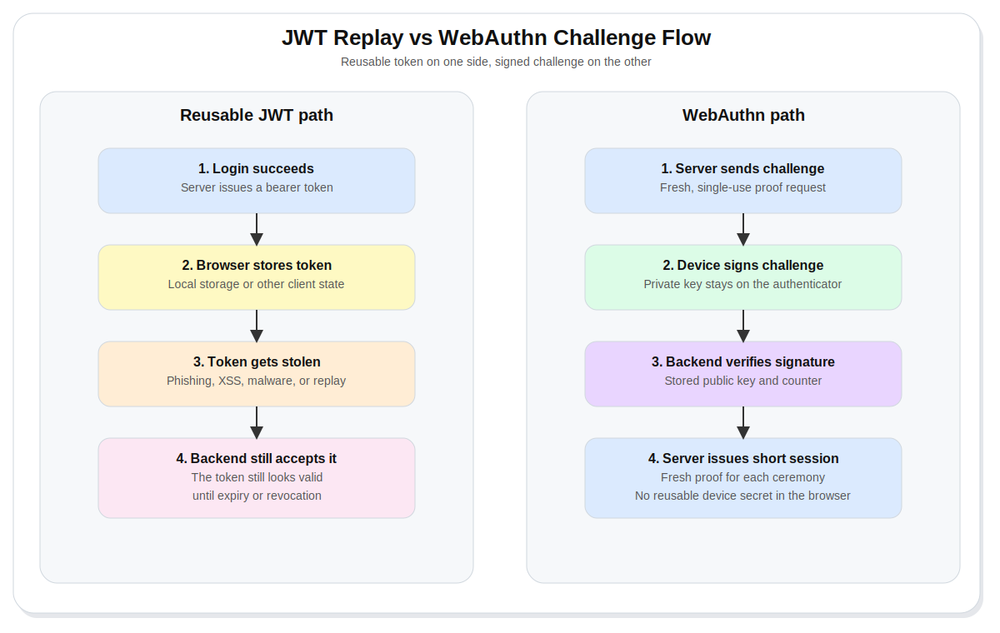
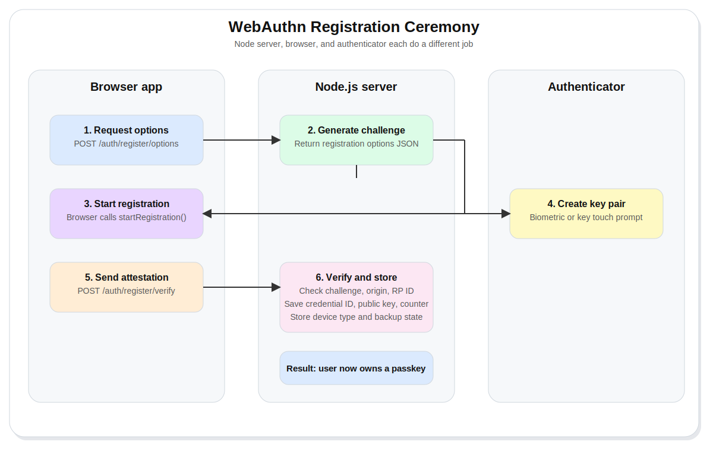
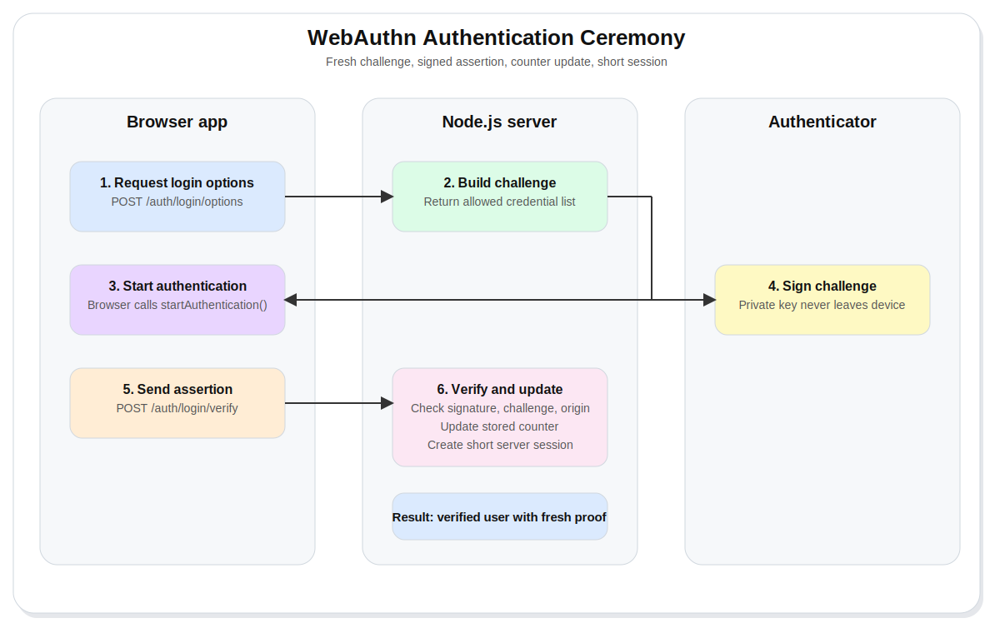
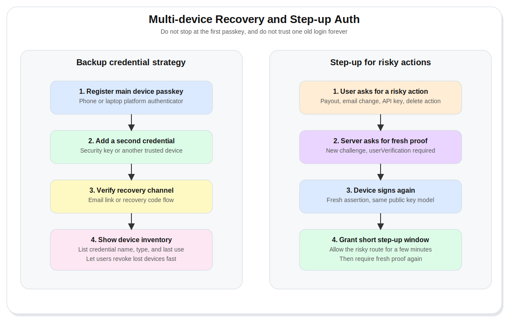

# WebAuthn in Node.js, Passwordless Biometric Login

JWT auth feels clean until a stolen token still looks valid to your server.

That is the real problem. A bearer token proves possession of a token. It does not prove possession of a trusted device. If an attacker gets a reusable token, replay starts to look like a normal login.

WebAuthn changes the shape of the system. The private key stays on the user's device. Your server stores a public key, a credential ID, and a counter. Each registration or login signs a fresh challenge. The browser, the authenticator, and your backend all take part in the ceremony.

This guide walks through the full path in Node.js. You will set up the backend, wire registration and login, store passkeys correctly, replace long-lived bearer auth with short server sessions, support backup devices, and add step-up verification for risky actions.

> Warning: WebAuthn works in secure contexts. Use localhost for local development. Use HTTPS everywhere else.

## Table of contents

- [Why JWT alone falls short](#why-jwt-alone-falls-short)
- [What WebAuthn changes](#what-webauthn-changes)
- [Install and verify](#install-and-verify)
- [Start the project](#start-the-project)
- [Define the data model](#define-the-data-model)
- [Build the server foundation](#build-the-server-foundation)
- [Registration ceremony](#registration-ceremony)
- [Authentication ceremony](#authentication-ceremony)
- [What replaces the long-lived JWT](#what-replaces-the-long-lived-jwt)
- [Multi-device and recovery logic](#multi-device-and-recovery-logic)
- [Step-up authentication for sensitive actions](#step-up-authentication-for-sensitive-actions)
- [Recap](#recap)

## Why JWT alone falls short

JWT is not the villain.

The weak point is the usual deployment pattern around JWTs. Teams often place long-lived tokens in places attackers love, then trust those tokens for too long.

The failure path usually looks like this:

- Your server issues a reusable bearer token.
- The browser stores it.
- Malware, XSS, session theft, or a fake login flow grabs it.
- The attacker replays it.
- Your backend sees a valid token and treats the request as real.

That pattern falls apart fast on high-risk routes. Admin actions, money movement, payout approval, email change, API key creation, or destructive writes deserve stronger proof.

WebAuthn gives you stronger proof because the secret never leaves the authenticator.



## What WebAuthn changes

WebAuthn uses asymmetric cryptography.

The authenticator creates a key pair. The private key stays on the device. Your backend stores the public key and uses it later to verify signatures. During login, your server sends a fresh challenge. The device signs it. Your backend verifies the result against the stored public key.

That changes three things at once:

- The browser never receives a reusable password secret.
- A stolen public key is useless for login.
- Each ceremony depends on a fresh server challenge.

On the web, passkeys ride on top of WebAuthn. A passkey might live on the local device, a synced platform account, or a physical security key. In practice, your app still deals with the same core objects: credential ID, public key, transports, counter, device type, and backup state.

## Install and verify

### Node.js and npm

Node.js runs the backend. npm installs the project packages.

Install Node.js with your usual method. Two common paths are the Node installer from the official site, or nvm if you manage multiple Node versions.

```bash
nvm install --lts
nvm use --lts
node -v
npm -v
```

Expected output is a Node LTS version and an npm version number.

### TypeScript and tsx

TypeScript types the backend. `tsx` runs TypeScript files during development.

```bash
npm install -D typescript tsx @types/node
```

Expected output is a TypeScript version and a `tsx` version.

### Express

Express handles the HTTP routes.

```bash
npm install express @types/express
npm ls express
```

Expected output is your dependency tree with `express` listed.

### express-session

`express-session` stores short-lived server session state. This is useful for pending challenges, pending user IDs, and post-login session state.

```bash
npm install express-session @types/express-session
npm ls express-session
```

Expected output is your dependency tree with `express-session` listed.

### SimpleWebAuthn packages

`@simplewebauthn/server` generates registration and authentication options in Node.js and verifies responses. `@simplewebauthn/browser` starts browser-side registration and authentication flows.

```bash
npm install @simplewebauthn/server @simplewebauthn/browser
npm ls @simplewebauthn/server @simplewebauthn/browser
```

Expected output is your dependency tree with both packages listed.

## Start the project

Create a new project and basic source folder.
❗️
```bash
mkdir webauthn-node-demo
cd webauthn-node-demo
npm init -y
npx tsc --init
mkdir src
```
❗️

Add the scripts you need.

```json
{
    "scripts": {
        "dev": "tsx watch src/app.ts",
        "build": "tsc",
        "start": "node dist/app.js"
    }
}
```

A clean starting structure looks like this.

```text
webauthn-node-demo/
  package.json
  tsconfig.json
  src/
    app.ts
    browser.ts
```

## Define the data model

Do not store passkeys as random JSON blobs inside the user document and hope for the best.

Store them like first-class auth records. A separate table or collection per credential is a clean pattern. You want one row per passkey, linked back to the user.

```ts
type Passkey = {
    id: string;
    publicKey: Uint8Array;
    counter: number;
    deviceType: "singleDevice" | "multiDevice";
    backedUp: boolean;
    transports?: string[];
};

type User = {
    id: string;
    email: string;
    webAuthnUserID: Uint8Array;
    passkeys: Passkey[];
};

const users = new Map<string, User>();

function findUserByEmail(email: string) {
    return [...users.values()].find((user) => user.email === email);
}
```

What matters here:

- `id` identifies the credential later.
- `publicKey` verifies future signatures.
- `counter` helps detect cloned or misbehaving authenticators.
- `deviceType` and `backedUp` give you useful recovery signals.
- `webAuthnUserID` should be a stable binary value, stored once per user.

> Tip: If your database returns `Buffer` or another binary wrapper for `publicKey`, convert it back to `Uint8Array` before verification.

## Build the server foundation

Now wire the core Express app and relying party settings.

```ts
import express from "express";
import session from "express-session";
import { randomBytes, randomUUID } from "node:crypto";
import {
    generateAuthenticationOptions,
    generateRegistrationOptions,
    verifyAuthenticationResponse,
    verifyRegistrationResponse,
    type WebAuthnCredential,
} from "@simplewebauthn/server";

const rpName = "Node Auth Lab";
const rpID = "localhost";
const origin = "http://localhost:3000";

declare module "express-session" {
    interface SessionData {
        currentChallenge?: string;
        pendingUserId?: string;
        userId?: string;
        stepUpUntil?: number;
    }
}

const app = express();

app.use(express.json());

app.use(
    session({
        secret: "replace-this-in-production",
        resave: false,
        saveUninitialized: false,
        cookie: {
            httpOnly: true,
            sameSite: "lax",
            secure: false,
            maxAge: 10 * 60 * 1000,
        },
    }),
);
```

That gives you the shared state you need for:

- registration challenge tracking
- authentication challenge tracking
- logged-in session state
- short step-up windows for risky actions

## Registration ceremony

Registration is where a device becomes a trusted credential for a user.

The flow looks simple on the surface, but there are three separate actors:

- your server creates the options and challenge
- the browser starts the ceremony
- the authenticator creates the key pair and returns attestation data



### 1. Return registration options from the backend

This endpoint creates a new user if needed, generates the registration options, and stores the challenge server-side.

```ts
app.post("/auth/register/options", async (req, res) => {
    const { email } = req.body;

    if (!email) {
        return res.status(400).json({ error: "Email is required" });
    }

    let user = findUserByEmail(email);

    if (!user) {
        user = {
            id: randomUUID(),
            email,
            webAuthnUserID: randomBytes(32),
            passkeys: [],
        };

        users.set(user.id, user);
    }

    const options = await generateRegistrationOptions({
        rpName,
        rpID,
        userName: user.email,
        userDisplayName: user.email,
        userID: user.webAuthnUserID,
        attestationType: "none",
        excludeCredentials: user.passkeys.map((passkey) => ({
            id: passkey.id,
            transports: passkey.transports,
        })),
        authenticatorSelection: {
            residentKey: "preferred",
            userVerification: "preferred",
        },
    });

    req.session.currentChallenge = options.challenge;
    req.session.pendingUserId = user.id;

    res.json(options);
});
```

A few decisions here matter:

- `attestationType: 'none'` keeps the flow lighter unless you need richer device provenance.
- `excludeCredentials` stops duplicate registration of the same authenticator.
- `userVerification: 'preferred'` lets the browser lean toward biometrics or local device unlock.

### 2. Start registration in the browser

On the browser side, you ask your backend for options, then pass them into `startRegistration()`.

```ts
import { startRegistration } from "@simplewebauthn/browser";

export async function registerPasskey(email: string) {
    const optionsResp = await fetch("/auth/register/options", {
        method: "POST",
        headers: {
            "Content-Type": "application/json",
        },
        body: JSON.stringify({ email }),
    });

    const optionsJSON = await optionsResp.json();

    const registrationResponse = await startRegistration({ optionsJSON });

    const verifyResp = await fetch("/auth/register/verify", {
        method: "POST",
        headers: {
            "Content-Type": "application/json",
        },
        body: JSON.stringify(registrationResponse),
    });

    return verifyResp.json();
}
```

Under the hood, the browser now speaks to the authenticator. That might trigger Face ID, Touch ID, Windows Hello, Android biometrics, or a physical security key prompt.

### 3. Verify the registration response and save the passkey

Once the browser sends the response back, verify it against the challenge and relying party details you stored earlier.

```ts
app.post("/auth/register/verify", async (req, res) => {
    const user = users.get(req.session.pendingUserId ?? "");

    if (!user || !req.session.currentChallenge) {
        return res.status(400).json({ verified: false });
    }

    let verification;

    try {
        verification = await verifyRegistrationResponse({
            response: req.body,
            expectedChallenge: req.session.currentChallenge,
            expectedOrigin: origin,
            expectedRPID: rpID,
        });
    } catch (error) {
        return res.status(400).json({
            verified: false,
            error:
                error instanceof Error ? error.message : "Registration failed",
        });
    }

    if (!verification.verified || !verification.registrationInfo) {
        return res.status(400).json({ verified: false });
    }

    const { credential, credentialDeviceType, credentialBackedUp } =
        verification.registrationInfo;

    user.passkeys.push({
        id: credential.id,
        publicKey: credential.publicKey,
        counter: credential.counter,
        transports: credential.transports,
        deviceType: credentialDeviceType,
        backedUp: credentialBackedUp,
    });

    req.session.currentChallenge = undefined;
    req.session.pendingUserId = undefined;

    res.json({ verified: true });
});
```

At this point, the user has no password hash in the hot path. The authenticator now holds the private key. Your server stores only what it needs for later verification.

## Authentication ceremony

Authentication is where the user proves possession of the registered credential.

The server issues a fresh challenge. The authenticator signs it with the device-held private key. The backend verifies the signature with the stored public key.



### 1. Return authentication options

Fetch the user, list allowed credentials, and store the new challenge.

```ts
app.post("/auth/login/options", async (req, res) => {
    const { email } = req.body;
    const user = findUserByEmail(email);

    if (!user) {
        return res.status(404).json({ error: "User not found" });
    }

    const options = await generateAuthenticationOptions({
        rpID,
        allowCredentials: user.passkeys.map((passkey) => ({
            id: passkey.id,
            transports: passkey.transports,
        })),
        userVerification: "preferred",
    });

    req.session.currentChallenge = options.challenge;
    req.session.pendingUserId = user.id;

    res.json(options);
});
```

### 2. Start authentication in the browser

The browser receives the options, then starts the ceremony.

```ts
import { startAuthentication } from "@simplewebauthn/browser";

export async function loginWithPasskey(email: string) {
    const optionsResp = await fetch("/auth/login/options", {
        method: "POST",
        headers: {
            "Content-Type": "application/json",
        },
        body: JSON.stringify({ email }),
    });

    const optionsJSON = await optionsResp.json();

    const authenticationResponse = await startAuthentication({ optionsJSON });

    const verifyResp = await fetch("/auth/login/verify", {
        method: "POST",
        headers: {
            "Content-Type": "application/json",
        },
        body: JSON.stringify(authenticationResponse),
    });

    return verifyResp.json();
}
```

### 3. Verify the assertion and update the counter

This is the moment where the backend decides whether the login is real.

```ts
app.post("/auth/login/verify", async (req, res) => {
    const user = users.get(req.session.pendingUserId ?? "");

    if (!user || !req.session.currentChallenge) {
        return res.status(400).json({ verified: false });
    }

    const passkey = user.passkeys.find((item) => item.id === req.body.id);

    if (!passkey) {
        return res
            .status(400)
            .json({ verified: false, error: "Passkey not found" });
    }

    const credential: WebAuthnCredential = {
        id: passkey.id,
        publicKey: passkey.publicKey,
        counter: passkey.counter,
        transports: passkey.transports,
    };

    let verification;

    try {
        verification = await verifyAuthenticationResponse({
            response: req.body,
            expectedChallenge: req.session.currentChallenge,
            expectedOrigin: origin,
            expectedRPID: rpID,
            credential,
            requireUserVerification: true,
        });
    } catch (error) {
        return res.status(400).json({
            verified: false,
            error:
                error instanceof Error
                    ? error.message
                    : "Authentication failed",
        });
    }

    if (!verification.verified) {
        return res.status(400).json({ verified: false });
    }

    passkey.counter = verification.authenticationInfo.newCounter;

    req.session.userId = user.id;
    req.session.currentChallenge = undefined;
    req.session.pendingUserId = undefined;

    res.json({ verified: true });
});
```

Two details here matter more than they first appear:

- `requireUserVerification: true` forces a stronger ceremony for the verification step.
- `newCounter` should overwrite your stored counter after each successful login.

That counter update is one of the few signals you have for spotting cloned or broken authenticators.

## What replaces the long-lived JWT

Do not run this full WebAuthn flow, then issue a week-long bearer token and call the job done.

That throws away the best part of the design.

A better model is:

- WebAuthn proves identity
- the server creates a short session
- the browser receives only an HTTP-only session cookie
- risky actions ask for a fresh WebAuthn assertion again

A tiny route guard shows the idea.

```ts
function requireSession(
    req: express.Request,
    res: express.Response,
    next: express.NextFunction,
) {
    if (!req.session.userId) {
        return res.status(401).json({ error: "Unauthorized" });
    }

    next();
}

app.get("/me", requireSession, (req, res) => {
    const user = users.get(req.session.userId ?? "");

    if (!user) {
        return res.status(404).json({ error: "User not found" });
    }

    res.json({
        id: user.id,
        email: user.email,
        passkeys: user.passkeys.length,
    });
});
```

This keeps the post-login browser state smaller and less reusable. The browser carries only a session cookie. The server owns the session state and its lifetime.

> Tip: Short sessions plus fresh WebAuthn for risky actions is a stronger shape than one long bearer token with broad scope.

## Multi-device and recovery logic

Strong auth fails fast if the first lost phone locks the user out forever.

You need a real backup story from day one.

The clean pattern looks like this:

- register one platform passkey on the user's main device
- register one extra credential, such as a security key or another trusted device
- verify a contact channel during account setup
- expose passkey management in account settings
- store device metadata so users see what is registered



A simple product rule helps here. Do not hide the second passkey flow inside a deep settings page. Put "Add another passkey" right after the first successful registration.

Passkeys also sync across major platform ecosystems. That helps the user experience, but your backend should still treat each registered credential as a first-class record with its own ID, public key, counter, device type, and backup state.

For account recovery, keep the bar high. Recovery should not become the weakest path in the whole system. Email magic links, recovery codes, and support-driven recovery all need rate limits, audit trails, and strict checks.

## Step-up authentication for sensitive actions

Logging in once should not grant silent permission for every dangerous route.

Step-up auth means this:

- the user is already signed in
- they try a sensitive action
- the server demands a fresh WebAuthn ceremony
- the app grants a short window for that one class of actions

Use this for:

- payout approval
- credential management
- email or phone change
- API key creation
- organization deletion
- role elevation
- access to billing controls

Start by issuing new authentication options with strict user verification.

```ts
app.post("/auth/step-up/options", requireSession, async (req, res) => {
    const user = users.get(req.session.userId ?? "");

    if (!user) {
        return res.status(404).json({ error: "User not found" });
    }

    const options = await generateAuthenticationOptions({
        rpID,
        allowCredentials: user.passkeys.map((passkey) => ({
            id: passkey.id,
            transports: passkey.transports,
        })),
        userVerification: "required",
    });

    req.session.currentChallenge = options.challenge;

    res.json(options);
});
```

Then verify the response and issue a short step-up window.

```ts
app.post("/auth/step-up/verify", requireSession, async (req, res) => {
    const user = users.get(req.session.userId ?? "");
    const passkey = user?.passkeys.find((item) => item.id === req.body.id);

    if (!user || !passkey || !req.session.currentChallenge) {
        return res.status(400).json({ verified: false });
    }

    const verification = await verifyAuthenticationResponse({
        response: req.body,
        expectedChallenge: req.session.currentChallenge,
        expectedOrigin: origin,
        expectedRPID: rpID,
        credential: {
            id: passkey.id,
            publicKey: passkey.publicKey,
            counter: passkey.counter,
            transports: passkey.transports,
        },
        requireUserVerification: true,
    });

    if (!verification.verified) {
        return res.status(400).json({ verified: false });
    }

    passkey.counter = verification.authenticationInfo.newCounter;
    req.session.stepUpUntil = Date.now() + 5 * 60 * 1000;
    req.session.currentChallenge = undefined;

    res.json({ verified: true });
});
```

A tiny guard handles the rest.

```ts
function requireRecentStepUp(
    req: express.Request,
    res: express.Response,
    next: express.NextFunction,
) {
    if (!req.session.stepUpUntil || req.session.stepUpUntil < Date.now()) {
        return res.status(403).json({ error: "Fresh verification required" });
    }

    next();
}

app.post("/billing/payout", requireSession, requireRecentStepUp, (req, res) => {
    res.json({ ok: true });
});
```

This is where WebAuthn stops being a login feature and starts becoming part of your authorization model.

## Recap

You started with a common weak pattern, a reusable token trusted for too long.

Then you replaced the core proof model:

- the device keeps the private key
- the server stores the public key and counter
- each ceremony signs a fresh challenge
- the app uses short server sessions after verification
- risky routes trigger fresh step-up authentication

That is the real shift.

WebAuthn is not a cosmetic login upgrade. It changes where trust lives. Once you move from reusable bearer proof to device-bound cryptographic proof, your Node.js auth stack starts to behave like a modern security system instead of a thin session wrapper.
